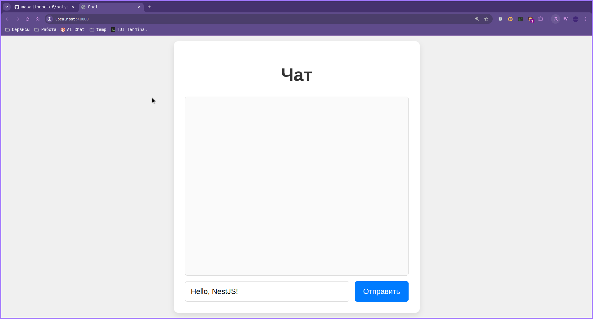

<p align="center">
  <a href="http://nestjs.com/" target="blank"></a>
</p>

# Чат-приложение на Socket.IO и NestJS

Это простое чат-приложение, использующее Socket.IO для общения в реальном времени между пользователями. Приложение состоит из клиента и сервера, написанных с использованием TypeScript и NestJS.

<p align="center">
  
</p>

## Сборка и запуск сервера:

```bash
$ yarn install

$ ./build.sh

# development
$ yarn run start

# watch mode
$ yarn run start:dev

# production mode
$ yarn run start:prod
```
